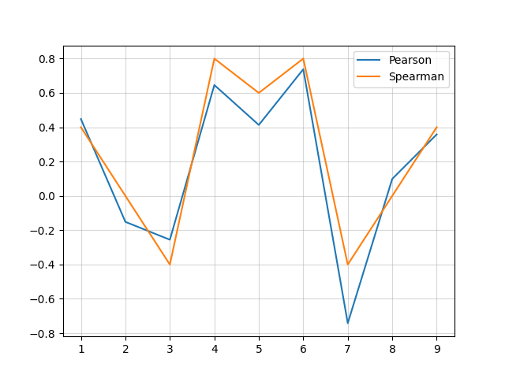
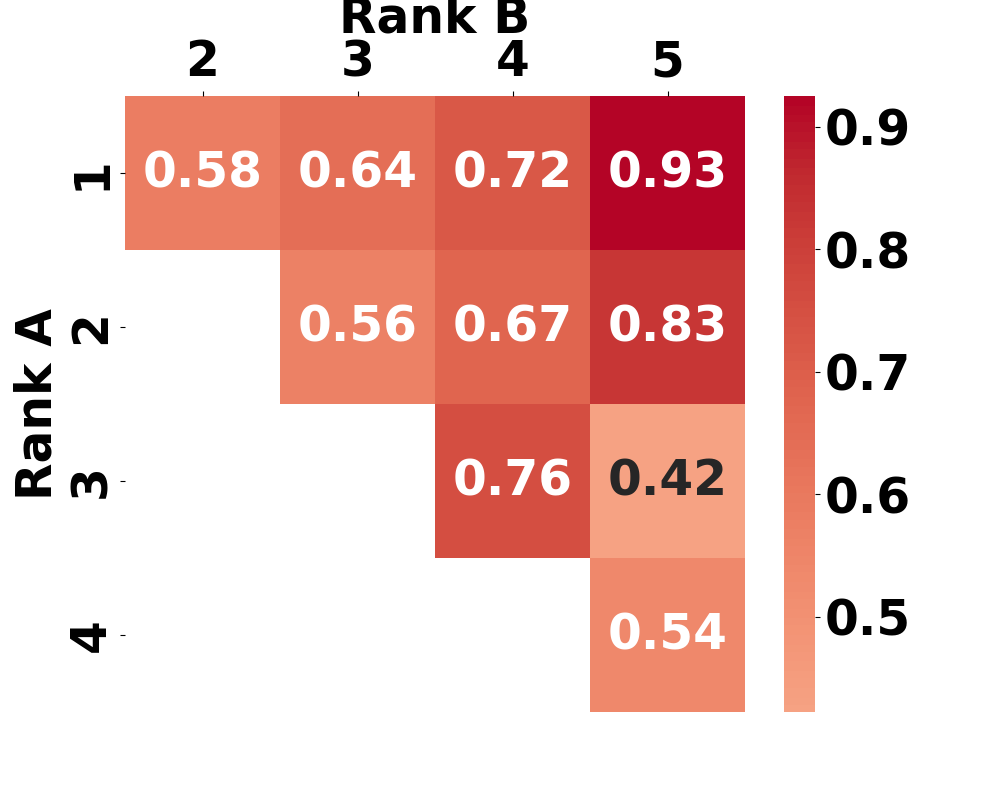

# Meta-evaluation Introduction

gec-metrics also supports meta-evaluation. 

## Preparation
Please run the following command beforehand to download the relevant datasets:

```bash
gecmetrics-prepare-meta-eval
```

## Import

Each meta-evaluation benchmark is implemented as a single class. These classes can be imported from `gec_metrics.meta_eval`.


```python
from gec_metrics.meta_eval import MetaEvalSEEDA
```

Alternatively, you can use `get_meta_eval()`. Available IDs can be obtained using `get_meta_eval_ids()`.

```python
from gec_metrics import get_meta_eval, get_meta_eval_ids
metric_cls = get_meta_eval('seeda')
print(get_meta_eval_ids())  # ['gjg', 'seeda']
```

## Initialize

Similar to metrics, initialize them by passing a Config object as needed.

```python
from gec_metrics.meta_eval import MetaEvalSEEDA
meta = MetaEvalSEEDA(MetaEvalSEEDA.Config(
    system='base'
))

# When using the default configuration.
meta = MetaEvalSEEDA()
```

## Meta-evaluation

Meta-evaluation is often discussed at two levels: corpus-level and sentence-level, and gec-metrics supports both.

### System-Level Meta-Evaluation

System-level meta-evaluation is performed using `corr_system()`.
This function compares system scores obtained from human evaluation with the evaluation results from `metric.rank_systems()`. You can control how the metric scores are calculated by specifying the `aggregation=` argument.

The return value is a dedicated Output class. If the human evaluation includes multiple aspects, the correlations with all of them are calculated and returned.

```python
from gec_metrics.meta_eval import MetaEvalSEEDA
from gec_metrics.metrics import GREEN
metric = GREEN()
meta = MetaEvalSEEDA()
sys_results = meta.corr_system(metric, aggregation='default')
print(sys_results)
```

### Sentence-Level Meta-Evaluation

Sentence-level meta-evaluation is performed using `corr_sentence()`. The return value is a dedicated Output class. If the human evaluation includes multiple aspects, the correlations with all of them are calculated and returned.

```python
from gec_metrics.meta_eval import MetaEvalSEEDA
from gec_metrics.metrics import GREEN
metric = GREEN()
meta = MetaEvalSEEDA()
sent_results = meta.corr_sentence(metric, aggregation='default')
print(sent_results)
```

## Analysis

### Window analysis

The window analysis proposed in SEEDA [[Kobayashi+ 24]](https://aclanthology.org/2024.tacl-1.47/) calculates correlations over subsets of systems extracted using a fixed-width window from systems sorted by human rank. This allows for analyzing the evaluation performance on sets of top-ranked or bottom-ranked systems according to human evaluation, as well as assessing the robustness of the evaluation across diverse system sets.

```python
from gec_metrics.meta_eval import MetaEvalSEEDA
from gec_metrics.metrics import ERRANT
import matplotlib.pyplot as plt
metric = ERRANT()
meta = MetaEvalSEEDA()
window_results = meta.window_analysis_system(metric, window=4, aggregation='default')
fig = meta.window_analysis_plot(window_results.ts_edit)
plt.savefig('window-analysis.png')
```

The result will be like this:




### Pairwise analysis

Pairwise analysis provides a more detailed examination of sentence-level meta-evaluation results. It groups the sentence-level meta-evaluation results based on human evaluation rank pairs and calculates the agreement rate within each group. This facilitates the analysis of trends, such as whether the metric demonstrates better agreement for pairs with larger differences in human evaluation ranks.

```python
from gec_metrics.meta_eval import MetaEvalSEEDA
from gec_metrics.metrics import ERRANT
import matplotlib.pyplot as plt
metric = ERRANT()
meta = MetaEvalSEEDA()
pairwise_results = meta.pairwise_analysis(metric)
fig = meta.pairwise_analysis_plot(pairwise_results['edit'])
plt.savefig('pairwise-analysis.png')
```

The result will be like this:

